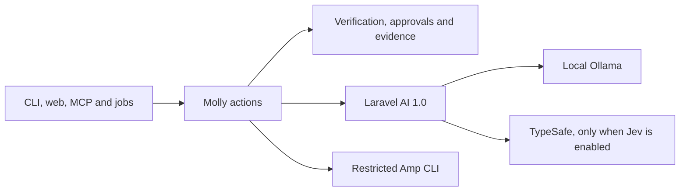

# AI ownership

MME-5811 audits commit `3e63850b5eb170cc0e6df9487a8dc5308230e2f5`. The first change replaces Laravel AI 0.11.2 and the temporary Jev development pin with Laravel AI 1.0. Molly already uses the SDK for Ollama generation, structured responses, and TypeSafe classification. Do not build another provider layer.

## Ownership matrix

Paths in a row share the stated responsibility. KEEP DOMAIN means Molly owns the behavior. REPLACE applies only to the named dependency or mechanism, not the surrounding policy.

| Paths and responsibility | Callers and persistence | Disposition and reason | Proof and issue |
| --- | --- | --- | --- |
| `composer.json`, `composer.lock`, `.github/workflows/tests.yml` | Composer and release checks; dependency versions | REPLACE 0.11.2 and the Jev commit alias with stable `laravel/ai ^1.0`. Keep `laravel/mcp ^1.0`. | Full package suite, required classification tests, fresh Laravel consumers. MME-5787, MME-5793 |
| `src/Agents/ChangeWriter.php`, `src/Agents/TarpitReviewer.php` | `src/Actions/GenerateChanges.php`, `src/Actions/ReviewChanges.php`; no agent memory | KEEP DOMAIN schemas and instructions. `Agent`, `HasStructuredOutput`, `Promptable::prompt` already delegate transport to Laravel AI. | `tests/Feature/AiActionsTest.php`, `tests/Feature/RunTaskTest.php`. MME-5790 |
| `src/Agents/LocalOllama.php` | Generation, review and environment checks; no state | KEEP DOMAIN loopback-only URL and local-model policy. Provider support does not authorize a remote endpoint. | `tests/Feature/AiActionsTest.php`, `tests/Feature/AgentSetupTest.php`. MME-5787 |
| `src/Agents/AmpResponse.php` | Generation and review; temporary isolated directory, deleted after use | KEEP DOMAIN restricted Amp CLI, tool refusal and terminal-event validation. Laravel AI has no Amp subscription CLI transport. Do not replace with a paid API or generic JSON repair. | `tests/Feature/AmpResponseTest.php`. MME-5790 |
| `src/Actions/GenerateChanges.php`, `src/Actions/ReviewChanges.php` | `src/Actions/RunTask.php`; proposals enter run reports only after validation | KEEP DOMAIN allowed paths, protected tests, seven Tarpit checks and evidence citations. SDK schema validation cannot decide these rules. | `tests/Feature/AiActionsTest.php`, `tests/Feature/ProtectedTestTest.php`, `tests/Feature/RunTaskTest.php`. MME-5790 |
| `src/Classification/LaravelAiChoiceClassifier.php` | `src/Actions/EvaluateWithTypeSafe.php`; no state | KEEP DOMAIN one `Classification::of()->question()->classify()` call through `Lab::TypeSafe`. No raw provider HTTP remains. | `tests/Feature/TypeSafeEvaluationTest.php`. MME-5791 |
| `src/Classification/ChoiceClassifier.php`, `src/Classification/ChoiceClassification.php` | Evaluator and its failure tests; no state | KEEP DOMAIN the external-provider contract and untrusted answer value. Unsupported capability and malformed answers are real behaviors, not speculative provider variants. | `tests/Feature/JevContractTest.php`. MME-5791 |
| `src/Classification/JevGate.php`, `src/Classification/DetectLaravelAiClassification.php` | Advice, planning, commit review and adapter selection; no state | KEEP DOMAIN the default-off policy and independent boolean/choice capability checks. Version text is provenance, not capability. | `tests/Unit/Classification/JevGateTest.php`, `tests/Unit/Classification/DetectLaravelAiClassificationTest.php`. MME-5791 |
| `src/Actions/EvaluateWithTypeSafe.php` | `RecommendTaskNextStep`, `SuggestPlanReview`, `ReviewCommit`; advisory result in reports | KEEP DOMAIN bounded evidence, finite choices, confidence threshold and stable reasons. Invalid distributions must not become authority. | `tests/Feature/JevContractTest.php`, `tests/Feature/TaskAdviceInterfacesTest.php`, `tests/Feature/CommitReviewTest.php`. MME-5791 |
| `src/Classification/ClassificationAdapter.php`, `src/Classification/LaravelAiClassificationAdapter.php`, `src/Classification/FallbackClassificationAdapter.php`, `src/Classification/ResolveClassificationAdapter.php`, `src/Classification/ClassifyRunEvidence.php`, `src/Classification/ClassificationDecision.php` | Run evidence and journal; serialized decision with nullable measurements | KEEP DOMAIN deterministic fallback, `Str::decide` boundary and journal vocabulary. A boolean answer is not a measured probability. MME-5252 owns any wider contract convergence. | `tests/Unit/ClassificationAdapterTest.php`, `tests/Unit/Classification/ClassificationDecisionTest.php`. MME-5791 |
| `src/Conversations/Conversation.php`, `src/Conversations/ConversationStore.php`, `src/Actions/EnsureRunConversation.php`, `src/Actions/ListConversations.php`, `src/Actions/ShowConversation.php` | Task/run inspection; JSON under the configured Molly home | KEEP DOMAIN task/run links and recorded run evidence. These are human inspection records, not remembered SDK turns. Generation does not replay this store. | `tests/Feature/MollyInspectionTest.php`, `tests/Feature/MollyProjectFlowsTest.php`. MME-5788 |
| `database/migrations/`, `src/Models/`, `src/Jobs/StartSavedTask.php` | CLI, web and queue; four tables for runs, tasks, plans and external thread links | KEEP DOMAIN attempt identity, approvals, repository revisions and work dispatch. No SDK conversation table, model job or model event requires conversion. | `tests/Feature/QueuedExecutionTest.php`, `tests/Feature/TaskExecutionTest.php`, `tests/Feature/JournalLifecycleTest.php`. MME-5788 |
| `src/Contracts/ApprovalRequirements.php`, `src/Actions/ApproveTask.php`, `src/Actions/DecideRunCompletion.php`, `src/Verification/` | Run/task acceptance and receipts | KEEP DOMAIN domain authority. A tool approval cannot pass Pest, approve source mutation, or waive a missing receipt. | `tests/Feature/ApproveTaskTest.php`, `tests/Feature/DecideRunCompletionTest.php`, `tests/Feature/VerificationReceiptsTest.php`. MME-5789 |
| `src/Knowledge/`, `src/Contracts/`, `src/Actions/RunTask.php` | Deterministic graph generation, execution targets, lifecycle and evidence | KEEP DOMAIN source provenance and domain state. No graph node exists merely to represent an SDK agent call in this path. | `tests/Feature/KnowledgeGraphTest.php`, `tests/Feature/ProjectGraphTest.php`, `tests/Feature/ParallelJoinTest.php`. MME-5792 |
| `src/Mcp/`, `src/Console/`, `src/Http/`, `src/Livewire/` | Transport entry points call actions; no separate completion truth | KEEP DOMAIN MCP server tools and action dispatch. This is a Laravel MCP server, not an MCP client. No client adapter is needed until a real consumer exists. | `tests/Feature/McpToolsTest.php`, `tests/Feature/TaskAdviceInterfacesTest.php`, `tests/Feature/PlanningInterfacesTest.php`. MME-5794 |
| `config/molly.php`, `src/Actions/ConfigureAgent.php`, `src/Actions/CheckEnvironment.php` | Setup, doctor and evaluator | KEEP DOMAIN `agent`, `model`, `timeout`, and five `jev` policy keys. `MOLLY_AGENT`, `MOLLY_LOCAL_MODEL`, `MOLLY_JEV_ENABLED` select application behavior. Credentials and Ollama URL remain in SDK config. | `docs/reference/configuration.md`, `tests/Feature/AgentSetupTest.php`. MME-5787 |
| `tests/Support/FakeChoiceClassifier.php`, `tests/Pest.php` | Domain failure tests | KEEP DOMAIN the domain answer fake for unavailable and malformed responses. SDK integration tests already use `Classification::fake()`; agent tests use `ChangeWriter::fake()` and `TarpitReviewer::fake()`. No HTTP fixture transport remains. | `tests/Feature/JevContractTest.php`, `tests/Feature/TypeSafeEvaluationTest.php`. MME-5793 |
| `README.md`, `docs/reference/configuration.md`, `docs/reference/glossary.md`, `.github/workflows/tests.yml` | Users, contributors and CI | DELETE current instructions to install an aliased development commit. Document stable v1 and require the real capability in tests. | Search for old pin and run Composer validation. MME-5811 |

## Dependency direction

Before: transports -> Molly actions and policy -> Laravel AI 0.11.2, or an explicit Jev development pin -> model provider.

After: transports -> the same actions and policy -> Laravel AI 1.x -> model provider. Amp remains a separate restricted CLI path. Verification, approval, graph stores, run receipts and conversations remain Molly-owned in both cases.

The baseline diagram has the same edges with Laravel AI 0.11.2 and an optional Jev development pin. The upgrade changes the SDK version and removes that pin. Neither model path decides task completion.

There is no remembered SDK conversation, custom SDK middleware, SDK usage reader, model streaming protocol, embedding client, vector store, failover chain or MCP client to migrate in Molly. Adding any of these would be new product work, not deletion.

## Order and rollback

1. Update the SDK constraint and lockfile. Require the shipped Jev capability in the normal tests and remove the development-only CI lane.
2. Run classification, Ollama-fake, Amp, approval, queued execution and full package tests. Test clean Laravel 12 and 13 consumers separately.
3. Remove stale setup instructions and record actual counts. Keep MME-5341 release proof tied to its own exact release; this change targets the next release after review.

No production data migration is required. Reverting the dependency and CI change restores the previous code path. Do not delete task evidence or conversation JSON during rollback.

MME-5200 and MME-5544 already supplied the Jev transport and convergence work. MME-5414 remains the broader file cleanup owner. This inventory does not recreate those implementations or their tickets.

## Measured change and verification

The dependency upgrade is implemented with Laravel AI `v1.0.0` at `101c7ea33cd8569d82570f753fbf38e48b7d3d95`. Laravel MCP remains `v1.0.0`. The comparison uses the baseline commit above and includes development dependencies.

| Measurement | Before | After |
| --- | --- | --- |
| Locked packages | 142 | 138 |
| PHP files in `src/Agents/` and `src/Classification/` | 15 | 15 |
| Physical lines in those files, including whitespace and comments | 781 | 781 |
| Production files importing Laravel AI | 8 | 8 |
| Production files importing Prism | 0 | 0 |
| Separate Jev development CI lanes | 1 | 0 |
| SDK conversation tables | 0 | 0 |

Composer removed `aws/aws-crt-php`, `aws/aws-sdk-php`, `mtdowling/jmespath.php` and `symfony/filesystem` because the new dependency solution no longer needs them. No production class or domain table was removed. The smaller lockfile and the deleted 43-line CI job reduce dependency maintenance; the retained classification contracts still protect failure behavior. These counts are file and line measurements, not Clever measurements or a complexity score.

On PHP 8.4.23, the baseline full suite passed 1,075 tests with 28 skips. The v1 suite passed 1,098 tests with 6,492 assertions and three skips. All three skips are in `tests/Feature/SandboxIsolationTest.php` because this macOS host lacks Landlock and user/network namespaces. Two obsolete tests describing the old dependency were removed; classification tests now require the shipped SDK capability. Composer strict validation, changed-file Pint and whitespace checks passed.

Fresh Laravel 12.69.2 and 13.33.0 applications installed the package with AI v1, migrated, created and read a saved task, and indexed the matching Laravel knowledge graph. In both applications, Jev off made no request and an SDK fake proved the enabled classification path. Those checks do not prove Linux sandbox execution, a live Ollama response, a paid TypeSafe request or the separate Packagist release gate.

For later measurements, compare `git show <baseline>:composer.lock` with the current lockfile and count the same tracked source paths. Do not count vendor source, generated knowledge stores or application policy as deleted AI plumbing. There are no unresolved replacement questions in this dependency change. The broader cleanup, shared classification contract and live execution proofs retain their existing ticket owners.
