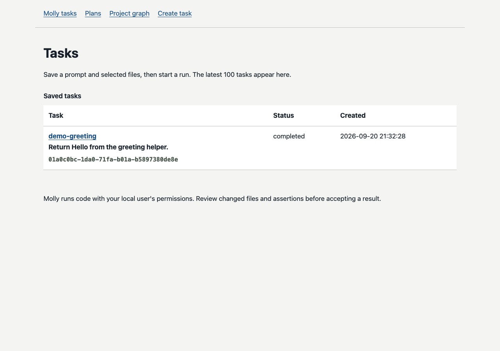
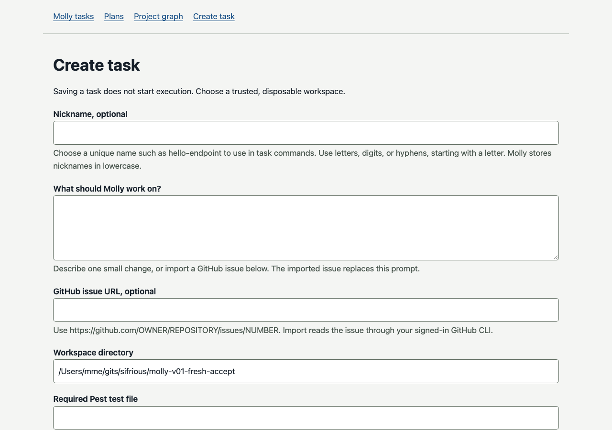
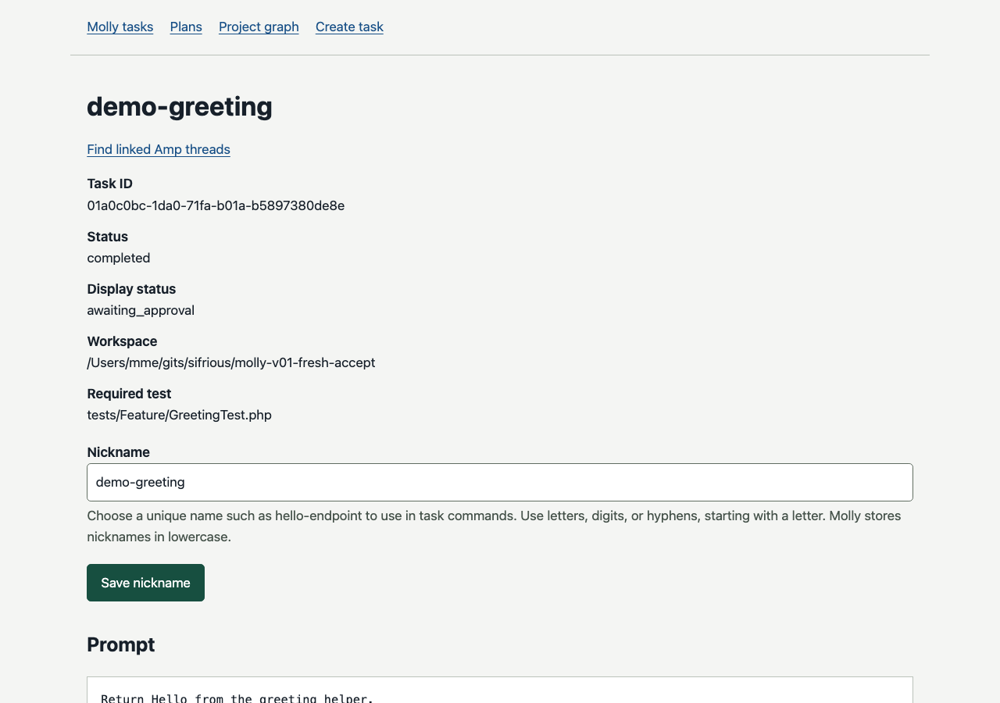
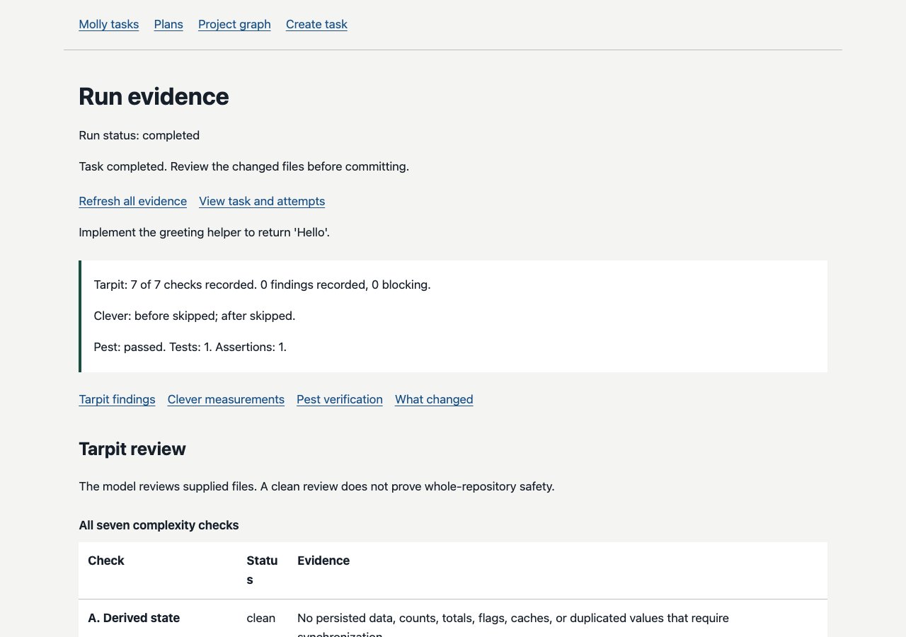

# v0.1 Walkthrough (screenshots)

> **Historical.** This page records work from the v0.1 release. It is kept for context and is not current install guidance. For today's install steps, read [Getting started](../getting-started.md).

Companion to [QUICKSTART](QUICKSTART.md) and [FRICTION](FRICTION.md). CLI steps stay in QuickStart; images below show Molly’s **local web UI** after a demo task exists.

**Bloom:** Bloom workspace/UI is out of this automated set. Treat Bloom-native steps as Manual.

**Sandbox:** On macOS, `molly:doctor` may report `sandbox_unavailable`. Trusted Studio proof only may set `MOLLY_SANDBOX_ALLOW_UNSAFE=1` (see FRICTION). Do **not** enable that for untrusted repos. Default QuickStart stays safe-sandbox.

Screenshots: `docs/v0.1/walkthrough/*.png` (no secrets; loopback UI only).

## 1. Install

From a Laravel 12/13 app with Pest and a working database, follow the [QUICKSTART copy-paste](QUICKSTART.md). Composer tagged `sifrious/molly:^0.1.1` (Packagist or public VCS), publish config, migrate, pull a local Ollama model, `molly:setup`, `config:clear`.

## 2. Doctor

```bash
php artisan molly:doctor
```

Expect loopback Ollama + Pest + DB ready. If Sandbox fails with `sandbox_unavailable`, stop or use the Studio-only FRICTION override — do not skip reading that section.

## 3. Demo / start

```bash
php artisan molly:demo
php artisan molly:start demo-greeting
```

If a prior start failed and the task is not pending, use `php artisan molly:retry demo-greeting` after doctor is green.

Enable the local UI only on loopback (`.env`):

```bash
MOLLY_UI_ENABLED=true
php artisan config:clear
php artisan serve --host=127.0.0.1 --port=8765
```

Open [http://127.0.0.1:8765/molly](http://127.0.0.1:8765/molly):



Create-task form (optional):



## 4. Inspect task / run

Task detail for `demo-greeting`:



Completed run report:



CLI equivalents:

```bash
php artisan molly:task demo-greeting
php artisan molly:show RUN_ID --verbose
```

## Regenerate screenshots

On Mac Studio with Google Chrome installed, against a local consumer that already has Molly UI enabled and a demo task/run:

```bash
# from the sifrious/molly checkout
export MOLLY_WALKTHROUGH_BASE_URL=http://127.0.0.1:8765
export MOLLY_WALKTHROUGH_TASK_ID=<task-uuid>
export MOLLY_WALKTHROUGH_RUN_ID=<run-uuid>
./bin/molly-docs-walkthrough
```

Uses Chrome headless (`--screenshot=`), not a cloud browser. Do not point the base URL at a non-loopback host.
